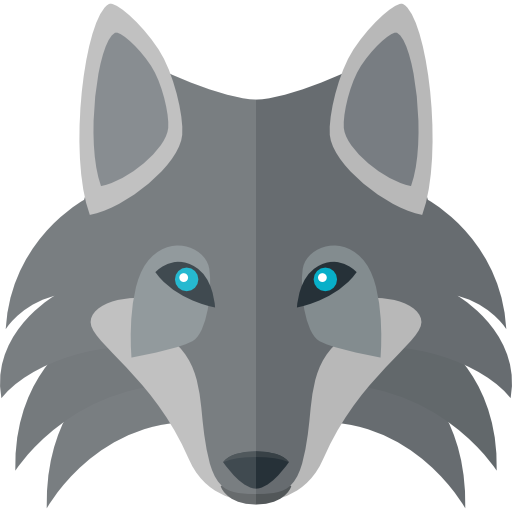

<div align="center" id="top">
  

  <!-- <a href="https://werewolf.netlify.app">Demo</a> -->
</div>

<h1 align="center">狼人杀</h1>

<p align="center">
  

  
</p>

<h3 align="center"><a href="http://werewolf.xiong35.cn/">在线使用地址: http://werewolf.xiong35.cn</a></h3>

<p align="center">
  <a href="#dart-简介">简介</a> &#xa0; | &#xa0;
  <a href="#sparkles-features">Features</a> &#xa0; | &#xa0;
  <a href="#rocket-技术栈">技术栈</a> &#xa0; | &#xa0;
  <a href="#deciduous_tree-目录结构">目录结构</a> &#xa0; | &#xa0;
  <a href="#white_check_mark-使用指南">使用指南</a> &#xa0; | &#xa0;
  <a href="#memo-license">License</a> &#xa0; | &#xa0;
  <a href="#hugs-thanks">Thanks</a> &#xa0; | &#xa0;
  <a href="https://github.com/xiong35" target="_blank">作者</a>
</p>

<br>

## :dart: 简介

一款线下狼人杀软件.  
为了免去线下打狼时必须带牌和需要主持人的麻烦, 我制作了一款狼人杀网站, 希望给你带来方便 ;P

## :sparkles: Features

### 特色

:heavy_check_mark: 无需带卡牌, 全自动发牌  
:heavy_check_mark: 简洁而不失优美的 UI  
:heavy_check_mark: 无需主持人, 全自动游戏  
:heavy_check_mark: 部署于网站, 适配全设备, 随时可以开一把  
:heavy_check_mark: 可配置各个角色人数  
:heavy_check_mark: 可进行警长竞选  
:heavy_check_mark: 现阶段支持守卫, 猎人, 预言家, 女巫, 村民, 狼人 6 种角色  
:heavy_check_mark: 可在游戏中查看事件表、编写备忘  
:heavy_check_mark: 即是中途不小心退出游戏, 也可刷新页面直接重连  
:heavy_check_mark: 可查看历史对局  
:heavy_check_mark: 数据完全安全, 杜绝任何形式的作弊

### 不足

🥺 **不支持**实时语音交流, 仅供线下面基使用

## :rocket: 技术栈

本项目主要运用以下技术:

- [Koa](https://koajs.com/)
- [socket.io](https://socket.io/)
- [Vue3](https://vue3js.cn/)
- [TypeScript](https://www.typescriptlang.org/)

## :deciduous_tree: 目录结构

```txt
├── docs                          # 随手写的笔记
├── LICENSE                       # 开源许可证
├── reload.sh                     # 重启项目的脚本
├── werewolf-backend              # **后端相关代码**
│   ├── dist                      # 打包生成的文件目录
│   ├── package.json
│   └── src                       # *代码目录*
│       ├── handlers              # 具体逻辑
│       ├── index.ts              # 项目入口
│       ├── middleware            # 中间件
│       ├── models                # 基于公用定义封装的后端模型定义
│       ├── routes                # koa 路由
│       ├── utils                 # 工具函数
│       └── ws                    # web socket 相关逻辑
└── werewolf-frontend             # **前端相关代码**
    ├── dist                      # 打包生成的文件目录
    ├── public
    │   └── assets                # 存放静态资源的目录
    ├── shared                    # 前后端公用的模型定义, 接口定义, 数据定义等
    └── src                       # *代码目录*
        ├── components            # 可复用的组件
        ├── http                  # 网络相关模块
        ├── pages                 # 路由组件
        ├── reactivity            # 抽离出的响应式数据及相关处理
        ├── router.ts             # 前端路由
        ├── socket                # web socket 相关逻辑
        └── utils                 # 工具函数
```

## :white_check_mark: 使用指南

### 开发者

使用前 :checkered_flag:, 拥有 git 和 node 环境

```bash
# Clone this project
$ git clone https://github.com/xiong35/werewolf

# Access backend
$ cd werewolf/werewolf-backend
# Install dependencies
$ npm i
# Run the project
$ npm run dev

# Access frontend
$ cd ../werewolf-frontend
# Install dependencies
$ npm i
# Run the project
$ npm run dev
```

### 使用者

直接访问[网址](http://werewolf.xiong35.cn/)即可!

## :memo: License

本项目使用 MIT 证书. 查看 [LICENSE](LICENSE) 以了解详情.

Made with :heart: by <a href="https://github.com/xiong35" target="_blank">xiong35</a>
&#xa0;

## :hugs: Thanks

<div>Icons made by <a href="https://www.freepik.com" title="Freepik">Freepik</a> from <a href="https://www.flaticon.com/" title="Flaticon">www.flaticon.com</a></div><div>Icons made by <a href="https://www.flaticon.com/authors/wanicon" title="wanicon">wanicon</a> from <a href="https://www.flaticon.com/" title="Flaticon">www.flaticon.com</a></div>

&#xa0;

<a href="#top">Back to top</a>
